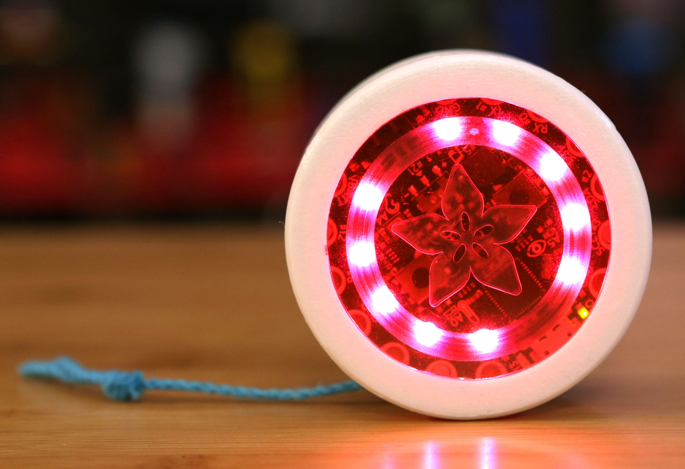
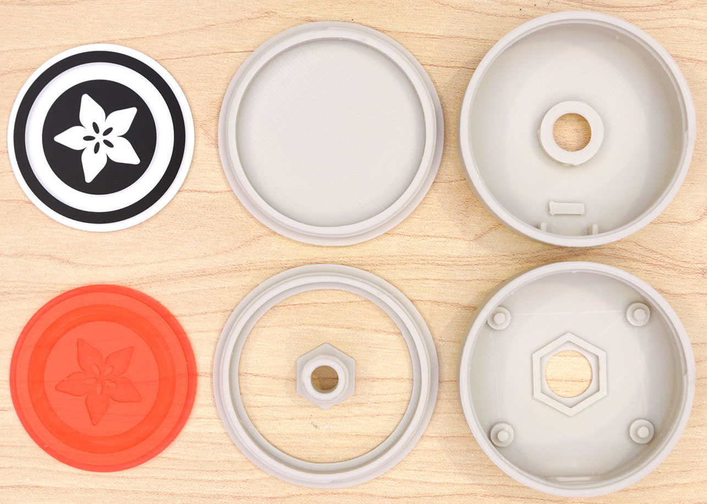

# Bioe 421/521: Microcontroller Applications
#### Instructor: Jordan Miller TA: Madeleine Gomel github.com/jmil/Bioe421_521-MicrocontrollerApplications

## Lab 7. Diving Deeper into the Circuit Playground

### Charge up your Circuit Playground Battery
	
You will want to be able to use Circuit Playground on battery power, so start today's lab by charging up your battery using the included USB charger.

### Review Circuit Playground Tutorials

Adafruit and friends have made some great informational pages and tutorials to better explain Circuit Playground and its potential.

1. Read and discuss pp 1-56 of Circuit Playground Lesson # 0 (attached).

1. Read and discuss all of the pages explaining Circuit Playground functions -- **see HANDOUT** and here's the link FYI:

	https://caternuson.github.io/Adafruit_CircuitPlayground/

1. Study and try all of the example sketches in the `Adafruit_CircuitPlayground ` folder in your `github` folder. If you want to download them again, the instructions are:

		$ mkdir -p ~/github
		$ cd ~/github
		$ which git
		$ git clone https://github.com/jmil/Adafruit_CircuitPlayground.git
		$ ls -la
		$ cd Adafruit_CircuitPlayground
		$ ls -la

## Assignment

### 1. Modify the Example Sketches
		
1. Devise some clever/inventive/exciting/fun modifications of one of these awesome `.ino` files. For example, you could add music to a sketch that uses the LEDs, or add light output to a sketch that uses the speaker. There are many possibilities; you're only limited by your imagination.

1. You will want to **FIRST** copy the relevant folder out of the examples folder and into a folder for today's lab:

		$ mkdir -p ~/Team09-Lab07/custom
		$ cd ~/Team09-Lab07/custom
	
1. Discuss with your Instructor your intended modification and some ways you could make it happen. What's your plan?

		:
		:
		:
		:
		:
		:
		
	In which directory will you be working?
	
		:
		

#### You need to be sure to test and debug it on your Circuit Playground hardware!

Remember, with microcontroller projects: test early and often. Each significant change you make to your .ino, you should be uploading it and testing to verify that 1) you didn't introduce syntax errors, 2) the software compiled and built correctly, and 3) the change you think you made actually got made. A common problem here is not properly closing your `for{}` or `while{}` loops with the proper syntax. Get to know the Arduino language reference we discussed in lecture if you have problems: http://arduino.cc/en/Reference/HomePage

#### Do not spend 2 hrs straight editing the file and then upload it once to test. That is not a recommended use case for Circuit Playground programming. Test early and often. You have been warned!!

### 2. Yo-Yo YOLO!

Circuit Playground is round, has a 3-axis accelerometer, 10 RGB LEDs, and a speaker built in. Round things can roll, but it's better if they don't roll tooooo far if you're trying to program and debug them. So, if we leashed our Circuit Playground, we could make... a dynamically lit yo-yo!

1. Your instructor has already 3D printed the parts for you. Choose one complete set for your team (feel free to mix colors):

1. Follow the Circuit Playground yo-yo assembly tutorial, with the following two caveats:

	1. You don't need to use the wiring switch, so just ignore that part.
	1. And **DO NOT GLUE IT TOGETHER**. You and your Instructor will need to be able to use your Circuit Playground for other stuff this semester. You may use glue sparingly **ONLY** to glue the plastic axle to the plastic bottom case piece.

1. Now let's program! Work in the following directory:
	
		$ mkdir -p ~/Team09-Lab07/yoyo
		$ cd ~/Team09-Lab07/yoyo
		
	Design, write, and copiously comment an appropriate Arduino sketch that uses the yo-yo's motion to light up the LEDs. Think creatively, e.g. note that you can use the Circuit Playground's speaker to add sound effects.
	
	**PRO-TIP:** To work efficiently, think about which of the demo scripts best captures what you are trying to do. It's totally fine if your first prototype is a frankenstein-combination of several of the demo scripts we've already tried out. This would allow you to quickly test early and often, and then spend time refining the code to precisely your specifications.

1. Use your Raspberry Pi Camera to take ≥ 5 photos and ≥ 2 videos of your functional yo-yo in action. **The team that makes the best yo-yo video will earn extra credit.**

### Upload your work from today

1. Zip up the arduino folder for Today's lab to make a single .zip file

		$ cd ~
		$ zip -r Team09-Lab07.zip Team09-Lab07

1. `scp` your team's homework .zip file to your Instructor's RaspberryPi. Your Instructor will provide you with the value to enter for **IP_ADDRESS**. Use your same `raspberry` password (note that you are logging in as user `student`):

		$ man scp
		$ scp Team09-Lab07.zip student@IP_ADDRESS:/home/student/

## Shutdown Procedure

1. Shutdown your Pi properly:

		$ sudo shutdown -h now

 Unplug everthing and restore the Windows desktop computer to a working state.

## APPENDIX

### Troubleshooting Circuit Playground

During our work with Circuit Playground it may eventually get confused and stop being able to connect to a computer. Here's how to fix it:

#### Symptoms:	
* From: [https://forums.adafruit.com/viewtopic.php?f=58&t=102881](https://forums.adafruit.com/viewtopic.php?f=58&t=102881)
	`jfmclaugh` writes:
	> Circuit Playground was working fine until recently- now all I get is a green light, and occasionally the red # 13 pulses when I press reset. It won't install- I get USB Device Not Recognized. I'm using a cable that worked OK before, still works fine on my smart phone. I reinstalled the drivers as well, no help. Please advise, thanks

* Another symptom is that you will no longer see Circuit Playground listed in the output from:

		$ dmesg | grep tty

	Nor will Circuit Playground be available in the `Ports` menu item in the Arduino IDE.

#### Solution 
* `adafruit_support_mike` responds:

	>Connect the Circuit Playground to your computer and open the demo sketch in the Arduino IDE. Select 'Circuit Playground' under Tools->Board, and don't bother with Tools->Serial Port. From the Preferences pane, select verbose output during upload.

	>Click the Upload button, and wait for a series of lines that begin with 'PORTS' to start scrolling past in the console pane.

	>Double-click the Circuit Playground's reset button at that point.

	>The ATmega32u4 handles USB communication within the chip, and sometimes the bootloader's USB code crashes. Double-clicking the reset button restarts the bootloader and forces it to set up a new USB connection exactly when the Arduino IDE is looking for a device to do that.

	> ...

	> It's more of a design tradeoff than a bug.

	> The ATmega32u4 has 32k of Flash memory which is shared by the bootloader and the user code. The USB connection to upload firmware is controlled by the bootloader, and the more protocol checking and fallback code we add there, the less useful the board gets as a development platform.

	> As your students will learn, microcontroller programming is all about making tradeoffs with limited resources.

