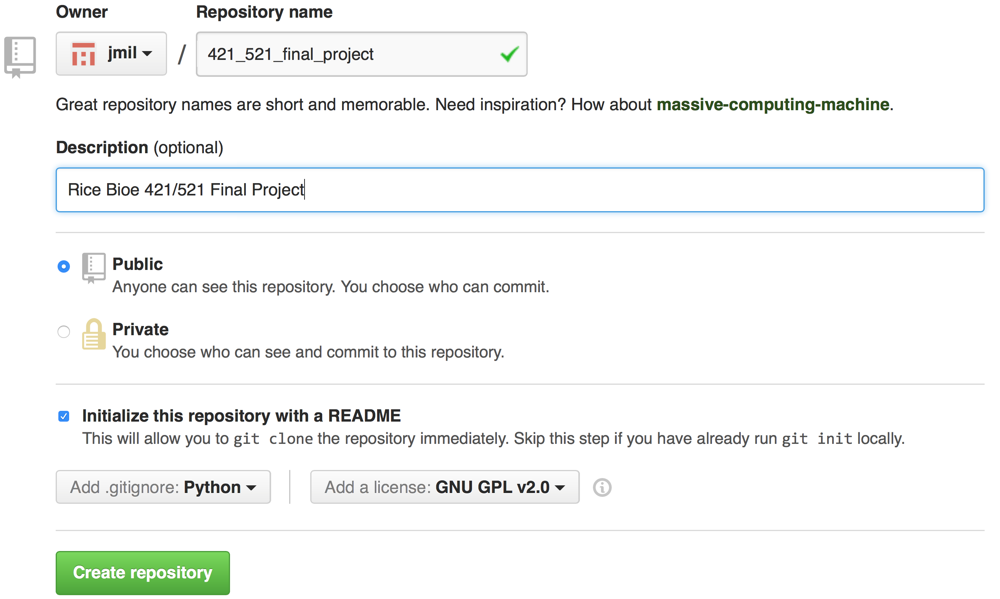
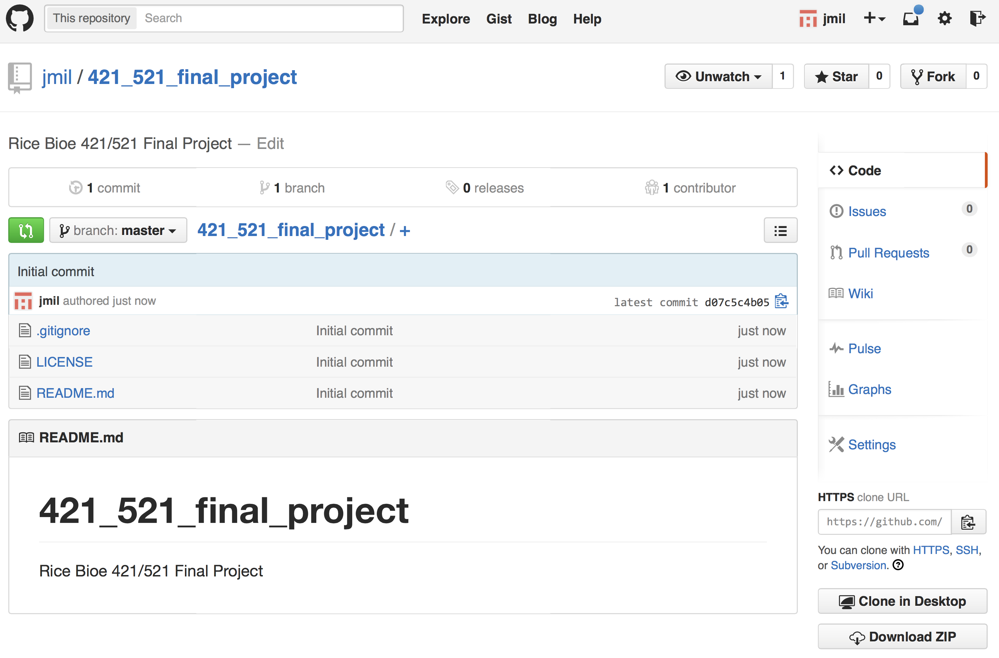

#Bioe 421/521: Microcontroller Applications
####Instructor: Jordan Miller TA: John Sexton github.com/jmil/Bioe421_521-MicrocontrollerApplications

##Lab 10. Git Workflows

In class we learned about **Version Control Systems (VCS)**, also known as **Source Control** (i.e. source code control) and **Revision Control**. We want to store all your code, all your comments, all your documentation, and the entire history of all your files into an intergrity-verified library or **repository** **(repo)**. Recall: we will use the distributed VCS (DVCS) `git` to manage all the code for your final project.

### Learning `git`

There are countless resources for learning `git` online. If you are new to `git`, follow Ch.1 in the `ProGit` open access book. It's available here online:
http://git-scm.com/book/en/v2/Getting-Started-About-Version-Control

Get started at the terminal at the section **First-Time Git Setup**. You want your commit messages to make sense and attribute author info correctly, so this section is very important:

	$ git config --global user.name "Jane Doe"
	$ git config --global user.email janedoe@example.com
	$ git config --list

###Using Github for your Final Project

http://www.github.com/ is one of the most popular site for managing `git` repos because it has advanced high performance server back-end, excellent user interface tools, and it's free to use.

###NOTE: Your class final project will be backed-up and submitted through github.

1. Make a github repo for your final project by navigating to:
http://www.github.com/new

	One of you will be the master account for your final project. Decide who that is, register an account if you don't have that already, and then create a new repo with the following settings (you should choose your own repo name and add a better description):

	**Create a New Git Repo** 

1. Next, take a look at the repo that you made. It should look very similar to this. Show to your Instructor:

	**Viewing Your Github Repo** 

1. Now we need to pull down a copy of this repo onto your Raspberry Pi. See in the bottom right of the page, it will say **HTTPS clone URL**. Instead, you need to click the **SSH** button, because we want to use the `SSH` variant of the clone URL. It will be something like:
	`git@github.com:jmil/421_521_final_project.git`

	Copy this to the system clipboard (if the button doesn't work, use the right-click function on your mouse). You might have to type this by hand.

	You will first need to be able to authenticate your connection to the github.com server. This is because you want to pull down the code, but also be able to authenticate with their server and push back up your changes without having to login every time.
	
	Follow the SSH Key Generation tutorial for github.com:
	https://help.github.com/articles/generating-ssh-keys/
	

	**HINT:** You need to put these authentication keys you generated you generated onto github.com in your user settings.

	Open a terminal on your Pi. Let's pull down your repo:

		$ cd ~
		$ git clone ENTER_YOUR_CLONE_URL_HERE
		Cloning into '421_521_final_project'...
		remote: Counting objects: 5, done.
		remote: Compressing objects: 100% (5/5), done.
		remote: Total 5 (delta 0), reused 0 (delta 0)
		Receiving objects: 100% (5/5), 7.38 KiB | 0 bytes/s, done.
		Checking connectivity... done.

	`git` uses `ssh` and it's own special `git` internet protocol (faster than HTTPS) to fetch the **remote objects** off the github server. These **objects** *are* your code! If you setup your defaults correctly there will be files pre-populated in this directory. Let's see what we got.

		$ cd 421_521_final_project
		$ ls -la

	Once you have read the contents of each file, explain each file to your Instructor.

1. Check the status of your repo:

		$ git status
		$ git log

1. Let's check for links between this local repo and the files that are on github:

		$ git remote -v
		origin	git@github.com:jmil/421_521_final_project.git (fetch)
		origin	git@github.com:jmil/421_521_final_project.git (push)

## Assignment: The `git/git` repo

The internet loves recursion, and `git` is no exception. `git` is a command-line program, whose source code should be developed using a distributed version control system (DVCS). Of course, `git` is developed using... you guessed it: `git`. Let's take a look:

	$ cd ~
	$ git clone git@github.com:git/git.git
	$ cd git

Look at the manual for `git log`, which git makes available by running `man` on the hyphenated `git-log`:

	$ man git-log

To answer the following questions, look at the earliest commit messages from Linus Torvalds in the `git log` history. Is there an easy way to invert the order of all of the commit messages? Show your Instructor the answer to the following questions:

1. Linus calls `git` the information manager from **where**?
1. `git` is a viable way of describing **what**?
1. What was the exact date, time, and timezone that `git` was first successfully used?

## Assignment: Read through ProGit Ch.2

Read through ProGit Ch.2 especially at the section **"Recording Changes to the Repository"**. This should show you how to go about making commits and uploading them to github (note that we have already setup the `origin` for you, which you verified with the command `git remote -v`).

## Assignment: Putting your Final Project on Github

Work on your final project in your **`~/421_521_final_project`** `git` repo. As you make each change, you will want to commit (save) and push (backup) each advance of your project (even the small ones!). Because `git` can do asynchronous and non-linear merges, you will want to commit early and often. Once you have `cd`'ed into your final project directory, you will probably do a sequence such as:

	 $ git status
	 $ git add .
	 $ git status
	 $ git commit -m "descriptive commit message here"
	 $ git status
	 $ git log

###By the end of class you should have completed the following tasks:

1. Move the contents of your Brainstorm and Abstract into the `README.md` file and use markdown to format it. You will want to check if you are formatting things properly by looking at your repo on github. Don't rename this file, the `README.md` file by default is rendered into HTML by github to make it easy for people to understand what's in the repo.

1.  Create a `milestones.md` file. Put a detailed set of deadlines you hope to accomplish for your final project. Start with proof of concept issues. What's the first thing you need to verify that the basic mechanics of your project will work? Be sure to overlay these milestones with the assignment due dates given on the Owlspace calendar. You can format such as:

		# Header here (title, names, etc.)
		## Milestones
		
		1. November 6th: Code brought to the level of XXX
		1. November 10th: Add Feature XXX
		1. November 13th: POC due. Demonstrate XXX
		...
	The more structured and organized you are here, the more your Instructor and TA will be able to help you achieve your project goals.

1. Put your code here! Hopefully you already have a coding framework for your final project. Is it Arduino? Is it python? Is it a combination? Store your files in this repo, and push your project far today. Don't wait until the last minute... remember that your commits are being logged too! So it will be pretty clear to your Instructors who is consistently putting in effort on their class projects.

###Upload your work from today

1. Push your latest changes up to the github server:

		$ cd YOUR_FINAL_PROJECT_DIRECTORY
		$ git push origin master

1. Verify that your push went through correctly: on github you should check the commit log and commit message to ensure your push was successful.

1. Add your partner's github user account, as well as your Instructor's github user account `jmil` as registered collaborators to your github project on github.com, and make sure you enable them to write changes to your repo. This will help with collaboration and troubleshooting as you progress.

1. Submit the URL of your repo on Owlspace for today's Assignment, and **be sure to include** the github username of you and your teammate (you each need your own personal github account!).

##Cleanup
###After you shut down your RaspberryPi for the day, be sure you securely reconnect your computer monitor to the PC at your station.

